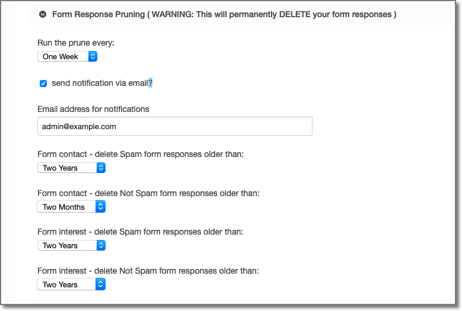
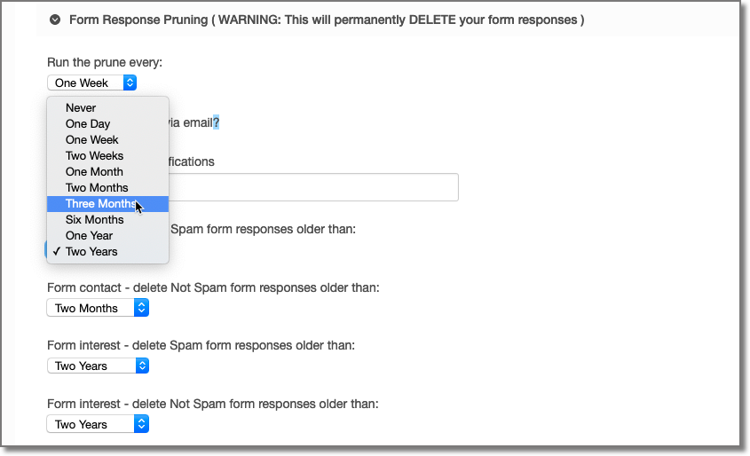
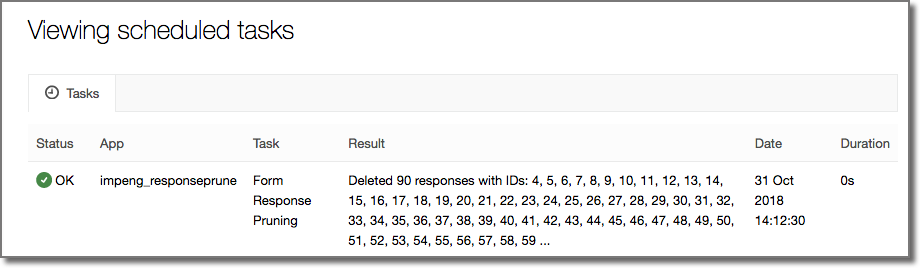
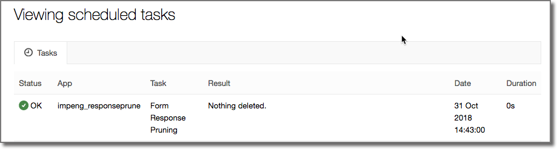

# Response Prune for Perch

An addon for Perch CMS that deletes form responses older than a set age. 

This no longer beta software, it has been in use on production sites for several months. It has proved particularly useful in GDPR scenarios where it is important to state how long data items are kept.

**WARNING: This will permanently DELETE your form responses from your database.**

The latest version has the following enhancements:
1. Added ability to control how often Response Prune runs.
2. Added separate configuration for spam listed responses.
3. Added the ability to send notification email whenever Response Prune deletes responses.

Code reviews, feature requests and all comments welcome. Just create an [issue](https://github.com/ImpressionEngineering/Perch-Response-Prune/issues/new).


## Prerequisites

Response Prune requires the following:

1. You take regular database backups.
1. The Perch Forms addon must be installed.
2. At least one form needs to be configured.
3. Scheduled tasks must be configured for your Perch installation. See [https://docs.grabaperch.com/perch/getting-started/installing/scheduled-tasks/](https://docs.grabaperch.com/perch/getting-started/installing/scheduled-tasks/)
4. Perch 3 (if you want to use on Perch 2 [let me know](https://github.com/ImpressionEngineering/Perch-Response-Prune/issues/new))

## Installation

1. Ensure you have a good database backup.
2. copy the `impeng_responseprune` folder from inside the download into the folder `perch/addons/apps/`.

2. Include the addon in the Perch apps config file `perch/config/apps.php` Include `impeng_resposeprune` after `perch_forms`.

```php
	$apps_list = [ 
		'perch_forms',
		'impeng_responseprune',
	];
```	

## Configuration

Once installed there will be a new section within the Perch settings for Response Prune (Perch Admin >> Settings >> General)



For each form on your Perch installation there will be two dropdowns to select the age that responses should be deleted. One for responses tagged as spam and one for responses NOT tagged as spam. The default configuration will not delete any responses. To activate pruning select a time period for the form and press Save.



There is a setting to determine how often Response Prune runs. It is important that you have set scheduled tasks to run at least this often.

You can also opt to have an email sent every time Response Prune runns and deletes some for responses.


## Viewing Results

Results for each run can be viewed on the Scheduled Task settings page (Perch Admin >> Settings >> Scheduled Tasks).



If there are no form responses to be deleted the scheduled task message will look like this:




## Limitations

The Scheduled Task message is restricted to 256 characters. If a large number of responses is deleted in a run then the Scheduled Task report may not contain all of the IDs of the messages deleted.


## Troubleshooting
You may find it helpful to trigger scheduled tasks from a browser rather than a scheduled `cron` task. Details available at [https://docs.grabaperch.com/perch/getting-started/installing/scheduled-tasks/](https://docs.grabaperch.com/perch/getting-started/installing/scheduled-tasks/)

## Roadmap

1. Record all response IDs deleted in a table.
2. Implement a full admin app with it's own pages for settings and results.
3. Add a "trial mode".
4. ~~Add ability to control how often Response Prune runs.~~ Complete
5. ~~Add separate configuration for spam listed responses.~~ Complete
6. Add some "are you sure" steps.

